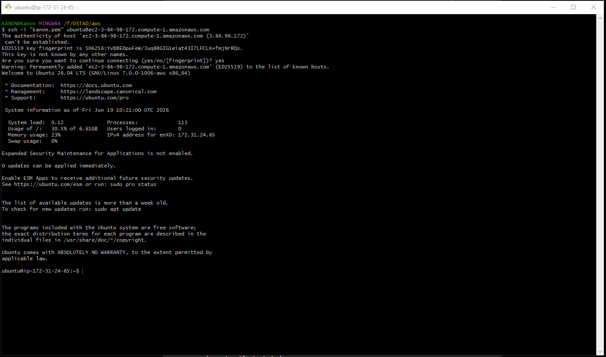
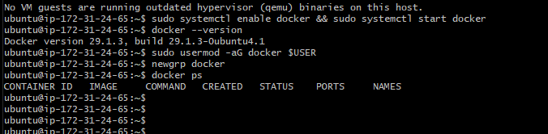
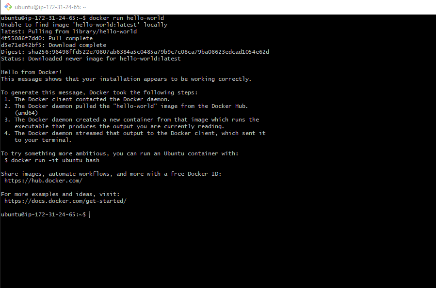
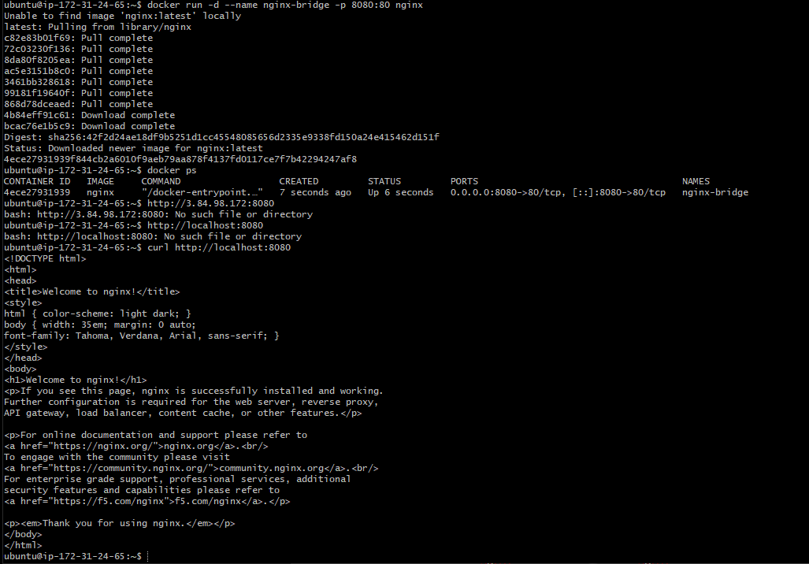
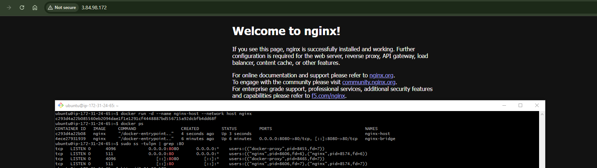
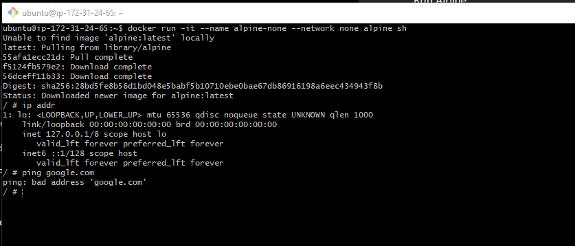
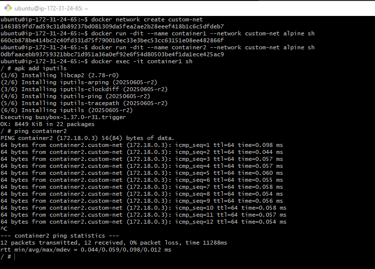

# Docker Installation and Networking on AWS EC2

## Assignment Objectives

- Install Docker on an AWS EC2 instance.
- Configure Docker permissions for a non-root user.
- Run the `hello-world` Docker image.
- Demonstrate Docker networking modes:
- Bridge Network
- Host Network
- None Network
- Custom Bridge Network

- Document commands, observations, and screenshots.

---


# Task 1: Launch AWS EC2 Instance

### Steps

1. Login to AWS Console.
2. Navigate to EC2 Dashboard.
3. Launch a new Ubuntu Server instance.
4. Configure Security Group:SSH (22)
5. HTTP (80)
6. Connect using SSH.

```
ssh -i mykey.pem ubuntu@
```

### Screenshot
Add screenshot:




---

# Task 2: Install Docker

## Update System

```
sudo apt update
sudo apt upgrade -y
```

## Install Docker

```
sudo apt install docker.io -y
```

## Start Docker Service

```
sudo systemctl enable docker
sudo systemctl start docker
```

## Verify Installation

```
docker --version
```
Expected Output:

```
Docker version  29.1.3
```

---

# Task 3: Configure Docker for Non-Root User

## Add User to Docker Group

```
sudo usermod -aG docker $USER
```
Apply Changes

```
newgrp docker
```
Verify

```
docker ps
```
Expected:

```
CONTAINER ID   IMAGE   COMMAND   CREATED   STATUS   PORTS   NAMES
```

### Screenshot



---

# Task 4: Run Hello World Container

## Pull and Run

```
docker run hello-world
```
Expected Output:

```
Hello from Docker!
This message shows that your installation appears to be working correctly.
```

### Screenshot



---


# Task 5: Bridge Network

The Bridge Network is Docker's default network mode. When a container is started without specifying a network, Docker automatically connects it to the default bridge network. Containers on the same bridge network can communicate with each other using IP addresses, while external access requires port mapping.

## View Existing Networks

```
docker network ls
```
Expected:

```
bridge
host
none
```

### Inspect Bridge Network

```
docker network inspect bridge
```

### Run Nginx Container

```
docker run -d --name nginx-bridge -p 8080:80 nginx
```
Verify

```
docker ps
```
Access

```
http://localhost:8080
```
Expected Result

Nginx Welcome Page appears.

### Screenshot




## Observation

- Container receives an internal Docker IP.
- Port mapping exposes container service externally.

---

# Task 6: Host Network

In Host Network mode, the container shares the host machine's network stack. The container does not receive its own IP address, and no port mapping is required.

## Run Container Using Host Network

```
docker run -d --name nginx-host --network host nginx
```
Verify

```
docker ps
```
Check Listening Ports

```
sudo ss -tulpn | grep :80
```
Access

```
http://localhost
```

### Screenshot





## Observation

- Container shares EC2 network namespace.
- No port mapping required.
- Container uses host port directly.

---

# Task 7: None Network

The None Network completely disables networking for the container. Only the loopback interface (lo) is available.

## Run Alpine Container

```
docker run -it --name alpine-none --network none alpine sh
```
Check Interfaces

```
ip addr
```
Attempt Ping

```
ping google.com
```
Expected:

```
ping: bad address 'google.com'
```

### Screenshot





## Observation

- Only loopback interface exists.
- No external network connectivity.

---

# Task 8: Custom Bridge Network

A Custom Bridge Network is a user-defined bridge network that provides automatic DNS-based service discovery. Containers can communicate using container names instead of IP addresses.

## Create Network

```
docker network create custom-net
```
Verify

```
docker network ls
```
Inspect

```
docker network inspect custom-net
```

### Run Containers
Container 1

```
docker run -dit --name container1 --network custom-net alpine sh
```
Container 2

```
docker run -dit --name container2 --network custom-net alpine sh
```

### Test Connectivity
Access container1:

```
docker exec -it container1 sh
```
Install ping utility:

```
apk add iputils
```
Ping container2:

```
ping container2
```
Expected:

```
64 bytes from container2
```

### Screenshot





## Observation

- Docker DNS automatically resolves container names.
- Containers communicate without exposing ports.

---

---

# Cleanup
Stop Containers

```
docker stop nginx-bridge nginx-host container1 container2
```
Remove Containers

```
docker rm nginx-bridge nginx-host container1 container2 alpine-none
```
Remove Custom Network

```
docker network rm custom-net
```


# Repository Structure

```
docker-networking-assignment/
│
├── README.md
│
├── screenshots/
│   ├── ec2-instance.png
│   ├── docker-non-root.png
│   ├── hello-world.png
│   ├── bridge-network.png
│   ├── host-network.png
│   ├── none-network.png
│   └── custom-bridge-ping.png
│
└── commands.txt
```